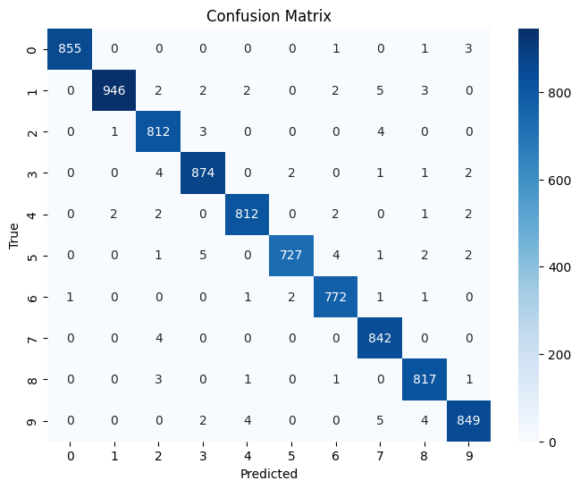

# 🧠 Handwritten Digit Classification Using Keras

This project demonstrates two approaches to classifying handwritten digits (0–9) using the TensorFlow/Keras library and the MNIST dataset.

---

## 📊 Dataset

- **MNIST**: 60,000 training images and 10,000 test images of handwritten digits (28×28 pixels, grayscale).

---

## 🏗️ Models

### 1. Dense Neural Network (`digit_dense.py`)
- Fully connected layers with ReLU activation
- Dropout layers to prevent overfitting
- L2 regularization for better generalization
- Optimizer: Adam

### 2. Convolutional Neural Network (`digit_cnn.py`)
- Convolutional layers (`Conv2D`) with `BatchNormalization` and `MaxPooling2D`
- Input normalization and reshaping to (28, 28, 1)
- Optimizer: RMSprop
- Confusion matrix visualization using `seaborn`

## 🧩 Confusion Matrix (CNN Model)



---

## 📁 Files

| File             | Description                                      |
|------------------|--------------------------------------------------|
| `digit_dense.py` | Dense model implementation                      |
| `digit_cnn.py`   | CNN model with input normalization and metrics  |
| `dense_model.h5` | Saved Dense model                               |
| `cnn_model.h5`   | Saved CNN model                                 |
| `requirements.txt` | Python dependencies                           |

---

## 📦 Installation

```bash
pip install -r requirements.txt

## 🚀 Run
python digit_dense.py   # for Dense model
python digit_cnn.py     # for CNN model

## 📈 Evaluation

Accuracy and loss plots
Confusion matrix (CNN version)


## 🛠️ Technologies Used
Python
TensorFlow / Keras
NumPy, Pandas
Matplotlib, Seaborn

## ✍️ Author
Created by https://github.com/Yul04ek


This project is licensed under the MIT License.


